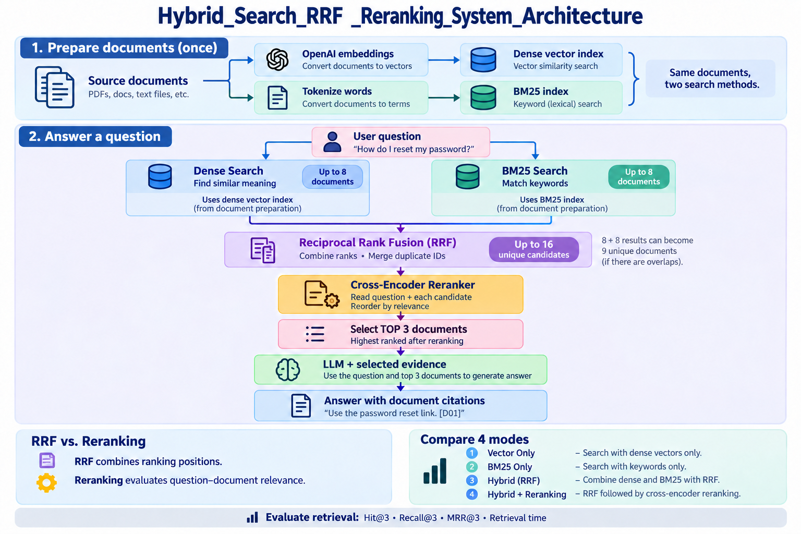
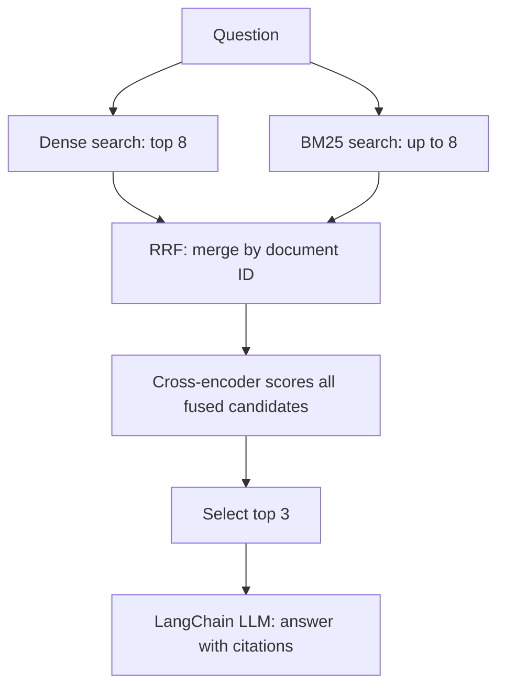

# Build a Hybrid Search + RRF + Reranking System

## Application_Architecture





A simple **LangChain** project with a complete retrieval pipeline:

**Dense Vector Search + BM25 → Reciprocal Rank Fusion → Cross-encoder Reranker → LLM**

The implementation uses ordinary functions. Run it from a terminal. The same question can be answered with Vector Only, BM25 Only, Hybrid, or Hybrid + Reranking.

## Files

| File | Purpose |
|---|---|
| `pipeline.py` | Load models/data, build indexes, retrieve, fuse, rerank and answer |
| `main.py` | Run a question or compare all four modes |
| `evaluate.py` | Compare retrieval quality against labeled questions |
| `data/documents.json` | 16 short fictional product-support documents |
| `data/questions.json` | 14 questions with relevant document IDs |
| `.env.example` | Model settings and empty API-key field |
| `requirements.txt` | Pinned direct dependencies |
| `test_pipeline.py` | Offline logic tests using model substitutes |

Each source document is already a small retrieval unit. There is no separate chunking stage. Titles and body text are both indexed. Edit the JSON to replace the sample documents; keep IDs unique and update evaluation labels when changing the corpus.

## 1. Install and configure

Use Python **3.11 or 3.12**. Extract the ZIP. Open a terminal inside `hybrid-search-langchain`, where `main.py` is located.

Windows PowerShell or Command Prompt:

```powershell
py -3.11 -m venv .venv
.venv\Scripts\python -m pip install -r requirements.txt
copy .env.example .env
```

If using Python 3.12, replace `py -3.11` with `py -3.12`.

macOS/Linux:

```bash
python3 -m venv .venv
.venv/bin/python -m pip install -r requirements.txt
cp .env.example .env
```

Open `.env` in your editor and enter your key:

```dotenv
OPENAI_API_KEY=your_actual_key_here
OPENAI_MODEL=gpt-4o-mini
EMBEDDING_MODEL=text-embedding-3-small
RERANK_MODEL=cross-encoder/ms-marco-MiniLM-L6-v2
```

The application reads environment variables using `python-dotenv`. Existing environment values take precedence over `.env`. Never commit your real key: `.gitignore` excludes `.env`; `.env.example` contains no secret.

You need working OpenAI API access. Embedding and chat requests incur usage charges. The cross-encoder runs locally on CPU without an additional API key. Package installation and the first Hugging Face model download require internet access; PyTorch can be a substantial download. Later runs reuse the model download and cached document embeddings.

## 2. Run a complete question

Windows:

```powershell
.venv\Scripts\python main.py "How can employees log in through our company identity provider?"
```

macOS/Linux:

```bash
.venv/bin/python main.py "How can employees log in through our company identity provider?"
```

The default mode is `hybrid_rerank`. JSON output contains:

- `dense` and `sparse`: the independent initial retrieval lists.
- `fused`: unique candidates ordered by RRF score, with original ranks/scores.
- `results`: the final top 3 documents, including reranker scores in reranking mode.
- `answer`: the LLM answer with requested document citations.
- `retrieval_ms`: query embedding through final document selection.
- `total_ms`: retrieval plus answer generation; startup is excluded.

D02 contains the Enterprise SSO policy relevant to this example. The answer should use that evidence when retrieved; exact wording and scores vary.

## 3. Compare the four modes

On Windows:

```powershell
.venv\Scripts\python main.py "What should my client do after an HTTP 429 response?" --compare
```

On macOS/Linux, replace `.venv\Scripts\python` with `.venv/bin/python` in this and subsequent commands.

This prints four results with four generated answers. To compare retrieval without calling the chat model:

```powershell
.venv\Scripts\python main.py "What should my client do after an HTTP 429 response?" --compare --no-answer
```

To select one mode:

```powershell
.venv\Scripts\python main.py "How do I reset my password?" --mode vector
.venv\Scripts\python main.py "How do I reset my password?" --mode bm25
.venv\Scripts\python main.py "How do I reset my password?" --mode hybrid
.venv\Scripts\python main.py "How do I reset my password?" --mode hybrid_rerank
```

`--no-answer` still requires query embeddings for modes using dense search. Startup prepares all resources even when selecting BM25 alone, so this application requires the key and reranker model for all modes.

## 4. Architecture and execution

At startup, `load_resources()` converts the JSON rows to LangChain Documents. The same texts become a normalized embedding matrix and a BM25 index. Document vectors are saved as `.npy` files under `cache/`. A hash of the embedding model name and exact indexed texts identifies the cache. Unchanged inputs reuse vectors; changed inputs create a new cache file.



Each retriever searches the full corpus with the original question. Neither uses the other's results. Calls run sequentially to keep the code easy to follow; retrieval remains independent.

| Mode | Retrieval and selection |
|---|---|
| Vector Only (`vector`) | Dense search → top 3 → LLM |
| BM25 Only (`bm25`) | BM25 search → top 3 → LLM |
| Hybrid (`hybrid`) | Dense + BM25 → RRF → top 3 → LLM |
| Hybrid + Reranking (`hybrid_rerank`) | Dense + BM25 → RRF → reranker → top 3 → LLM |

LangChain provides `Document`, `OpenAIEmbeddings` and `ChatOpenAI`. NumPy computes cosine similarity over normalized vectors. `rank-bm25` implements keyword retrieval. Sentence Transformers provides the cross-encoder.

Read the code in this order: `load_resources`, `dense_search`, `sparse_search`, `reciprocal_rank_fusion`, `rerank`, `generate_answer`, `search`, then `main.py` and `evaluate.py`.

## 5. Dense search and BM25

Dense search embeds the question and finds similar document meanings using cosine similarity. BM25 scores matching words, considering frequency, rarity and document length. The tokenizer lowercases text and extracts letters/digits/underscores. Both questions and documents use the same tokenizer. Only positive BM25 scores are retained; no matching words can mean no results.

The settings in `pipeline.py` are:

```python
CANDIDATE_K = 8  # Maximum results per retriever
TOP_K = 3       # Final documents passed to the LLM
RRF_K = 60      # Rank-fusion smoothing constant
```

If each retriever returns 8 documents with 3 overlapping IDs, fusion returns **13 unique candidates**, not 8. The reranker scores the entire union before selecting 3. With these settings, the union has at most 16 candidates.

## 6. RRF explained

RRF combines ranked lists using positions, instead of adding cosine and BM25 scores with different numerical scales:

```text
RRF(document) = sum of 1 / (60 + rank) across lists containing the document
```

Positions start at 1. Absence contributes zero. The constant 60 smooths rank differences; it is not the number of results.

Illustrative example, not a model benchmark:

| Document | Dense rank | BM25 rank | RRF calculation | Score |
|---|---:|---:|---|---:|
| A | 1 | absent | 1/61 | 0.016393 |
| B | 2 | 1 | 1/62 + 1/61 | 0.032522 |
| C | absent | 2 | 1/62 | 0.016129 |

Final fused order: **B, A, C**. B is supported by both searches. The code merges by ID, preserves source scores for inspection, records source ranks and adds contributions. Original dense/BM25 scores are not used in RRF arithmetic.

## 7. Reranking explained

The cross-encoder reads each question together with a candidate's text and produces a relevance score. It then orders candidates by that score. It can promote a document that answers the question more directly, but cannot retrieve missing documents. Its scores are not calibrated probabilities and are not added to RRF scores.

RRF combines ranks; the reranker examines text. In reranking mode, the final ordering is determined by cross-encoder scores. The configured 512-token limit applies to the combined question-document model input; long inputs are truncated. The sample documents are deliberately short.

The LLM receives the final document texts and IDs. Its prompt requests answers only from that evidence and asks it to acknowledge insufficient information. An empty result list returns an insufficient-information response directly. Citations are prompt-requested, not automatically verified.

## 8. Generate and explain final measured results

Run:

```powershell
.venv\Scripts\python evaluate.py
```

This evaluates all four modes on the same 14 labeled questions. It skips LLM answers so the metrics measure retrieval. Each active retriever gets 8 candidates; each mode selects at most 3. Hybrid methods naturally have the larger combined candidate pool.

| Metric | Meaning |
|---|---|
| Hit@3 | 1 if any relevant document appears in the top 3, else 0; averaged across questions |
| Recall@3 | Fraction of labeled relevant documents retrieved; averaged across questions |
| MRR@3 | Reciprocal rank of the first relevant document in the top 3, or 0; averaged |
| Mean retrieval ms | Average question embedding, retrieval, fusion and reranking time where applicable |

For relevant IDs `[D03, D04]` and results `[D10, D04, D11]`, Hit@3 is 1, Recall@3 is 0.5 and MRR@3 is 0.5.

Startup/indexing and LLM time are excluded. One warm-up per mode is excluded, and mode order rotates across questions. Timings include network variability and use only one measured run per question, so they are illustrative.

Outputs:

- `results/comparison.csv`: four-row summary, also printed to the terminal.
- `results/details.json`: each question's predicted IDs, labels, scores and metrics.
- `results/run.json`: timestamp, model settings, package versions and input-data hashes.

**No measured live-model results are bundled.** This environment was used for offline logic verification; OpenAI calls and real reranker inference were not executed. The evaluation command produces actual results using your configured models. No scores or winner are fabricated.

To explain your results, compare MRR@3 and Recall@3, then latency. Inspect per-question details to show where methods differ. A tie or a reranking regression is a valid observation. The script reports a best mode using MRR@3 then Recall@3, selecting the first mode if still tied; inspect the table for ties. This small fictional corpus does not establish general superiority. Use `--compare` to inspect answer faithfulness manually against the source text; retrieval metrics do not measure generated-answer quality.

## 9. Verification and troubleshooting

```powershell
.venv\Scripts\python -m unittest -v test_pipeline
```

Offline tests use real BM25 and explicit substitutes for embeddings, reranking and chat. They verify fusion, all four branches, top-k selection, empty retrieval behavior, metrics and validation. They do not establish live model quality.

Missing key: edit `.env` next to `pipeline.py`. Authentication/quota failure: check API account access. Model download failure: check Hugging Face connectivity. Import failure: use the same virtual-environment Python for installation and execution. If a configured OpenAI model is unavailable to your account, change its environment setting. Delete `cache/` to force document re-embedding if a cached file is damaged.

Direct dependencies are pinned. Transitive dependencies and remotely hosted models can change, so exact generated answers and timing are not guaranteed to repeat byte-for-byte. The code supplies cached ingestion, bounded candidate lists, input validation, evidence-bearing outputs, and OpenAI timeouts/retries as production-style pipeline practices. The in-memory corpus and single-process CLI are intended for this small project.

## References

- [LangChain OpenAI embeddings](https://docs.langchain.com/oss/python/integrations/embeddings/openai)
- [Sentence Transformers cross-encoder usage](https://www.sbert.net/docs/cross_encoder/usage/usage.html)
